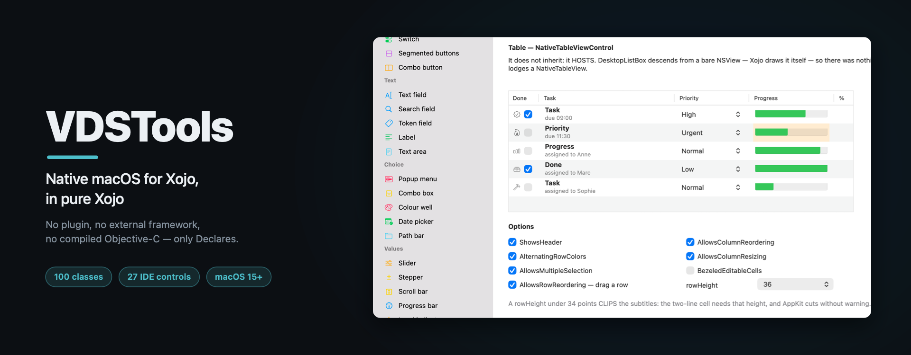

*[Version française : [README.md](README.md)]*

# VDSTools

Native macOS window chrome, toolbar and controls for Xojo — in pure Xojo.
No plugin, no external framework, no compiled Objective-C: only `Declare`s.

Targets **macOS 15** and later. Xojo IDE 2021r3 or newer.

This repository carries the **documentation** and the **released builds**. The library source is
not part of it.

---

## Download

Everything is in the [latest release](../../releases/latest):

| File | What it is |
|---|---|
| `VDSTools-x.y.z.xojo_library` | The compiled library, to add to a Xojo project |
| `VDSToolsDemoByLib.xojo_binary_project` | The demo project, which uses the library |
| `VDSToolsDemo-x.y.z.zip` | The demo application, ready to run |

## Pricing

| Licence | Price | What it grants |
|---|--:|---|
| **Compiled library** | **€60 incl. VAT** | The ready-to-use library and its updates |
| **Source code** | **€240 incl. VAT** | The same, plus the full source code, modifiable for internal use |

That is €50 and €200 excluding VAT, French VAT at 20% included — a business established in the
EU outside France is invoiced net of tax, on production of its VAT number. Per developer,
unlimited applications, royalty-free distribution. Orders go to **store@vdsc.fr**; the full terms are in
[CONDITIONS.en.md](CONDITIONS.en.md) — or [online](https://valdemar-vdsc.github.io/VDSTools-dist/conditions-en.html).

Payment is by **PayPal invoice**, sent on request and payable by card. State the **licensee name**,
exactly as it will be copied into the code, and the billing address. The key is sent **within 24
hours** of payment.

## Documentation

- [Developer reference — English](https://valdemar-vdsc.github.io/VDSTools-dist/docs/reference-en.html) — [the file](docs/reference-en.html)
- [Référence développeur — français](https://valdemar-vdsc.github.io/VDSTools-dist/docs/reference-fr.html) — [le fichier](docs/reference-fr.html)

It covers the 101 classes, their enumerations, and above all **58 traps**: the ones that cost
dearly, each with its symptom — which almost always points somewhere other than the cause.

The demo application is its living counterpart: **34 pages**, each showing one subject with its
code excerpt in the inspector, in French and English. A second window, **Placeable controls**
(Cmd+4), devotes a page to each of the 28 controls you drop in the IDE, with every option
adjustable live.

## What it brings

Xojo exposes neither `NSToolbar`, nor `NSSplitViewController`, nor the source-list sidebar, nor
view-based tables, nor window tabs, nor the system Window menu. VDSTools adds **101 classes**,
grouped by role:

| Area | Classes | Contents |
|---|--:|---|
| Core | 5 | The bridge to the Objective-C runtime, the owner registry, view hosting, system colours |
| Window | 3 | `NSSplitViewController` as window chrome, tabs, window level and behaviour |
| Sidebar | 3 | Flat or hierarchical sidebar, source-list style |
| Toolbar | 7 | `NSToolbar` and its item types, customisation sheet included |
| Controls | 27 | One AppKit control per class, from the button to the rich text editor |
| Placeable controls | 28 | The ones you **drop in the IDE**: fifteen inherit from a Xojo control, twelve host an AppKit object |
| Surfaces | 9 | Popover, alert, rich menus, vibrancy, boxes, 3D |
| Layout | 2 | `NSGridView` and `NSStackView` — the two controls that do away with coordinates |
| System | 17 | Menu bar, file panels, QuickLook, Dock, cursors, haptics, Finder |

## Getting started

1. Add the library to the Xojo project.
2. Set the licence in `App.Opening`, **before** any window is dressed:

```xojo
VDSLicence.SetLicence("Licensee name", "VDS01-XXXXXX-XXXXXX-XXXXXX-XXXXXX")
```

The name must be copied **exactly** as it appears on the licence: it goes into the code
calculation, and one extra space is enough to have it refused.

3. Dress the window:

```xojo
mChrome = New NativeWindowChrome
mChrome.Install(mSidebar.BuildSidebarView(230, Self.Height), 230, 200, 340)
mChrome.Title = "My application"
```

## Licence

**Running from the IDE is free** — the check is not even compiled under the IDE. A **built**
application without a valid licence runs, but carries a watermark.

The terms are in [CONDITIONS.en.md](CONDITIONS.en.md) — or [online](https://valdemar-vdsc.github.io/VDSTools-dist/conditions-en.html).

---

© 2026 VDSC — VDSTools
